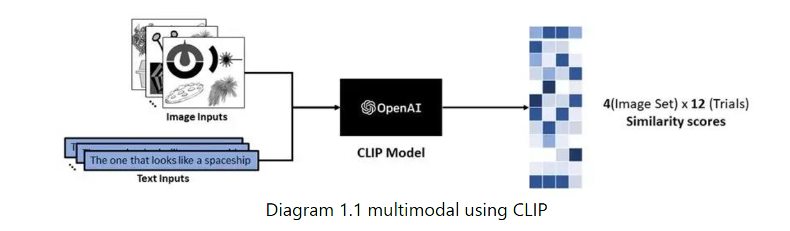
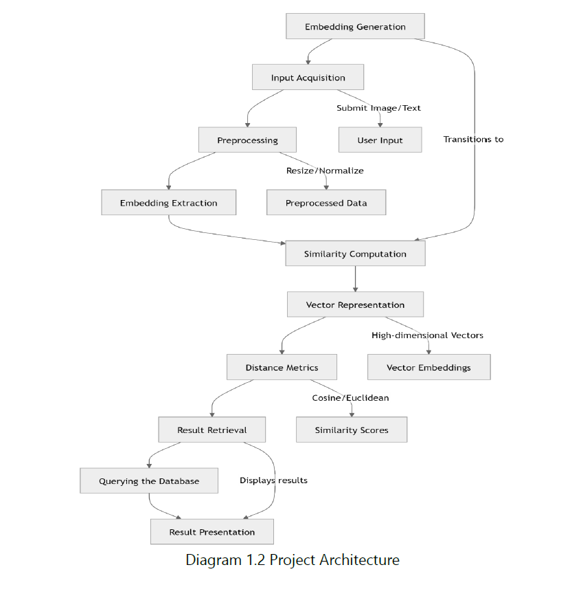

# Multi-Modal Image Retrieval System

## Description
This project introduces a **multi-modal image retrieval system** designed to perform efficient image searches using both textual descriptions and image queries. At its core, the system leverages **OpenAI's CLIP (Contrastive Language-Image Pretraining)** model to represent both text and images as vectors in a shared embedding space. This capability allows seamless comparison between text and image embeddings, enabling advanced retrieval functionalities.

### Key Features:
- **Dual Query Modes**: Search images using either a textual description or an uploaded image.
- **High-Performance Vector Search**: Uses **ChromaDB**, a high-performance vector database optimized for fast similarity search.
- **Intuitive User Interface**: Built with **Gradio**, providing a seamless interface for multi-modal queries.
- **Scalability**: Designed for large-scale image datasets with responsive performance.

### Use Cases:
- **Visual Search Engines**: Enhance user experience with cross-modal search capabilities.
- **Content Management Systems**: Streamline image retrieval for digital assets.
- **Multimedia Recommendation**: Recommend visually or semantically related content based on user input.

---

## System Architecture
1. **Image Indexing**:
   - Images are indexed by passing them through the **CLIP model**, which generates vector embeddings.
   - These embeddings are stored in **ChromaDB** for efficient similarity-based retrieval.

2. **Query Handling**:
   - **Text Query**: Converts input text into an embedding using the CLIP model and retrieves the most similar image embeddings.
   - **Image Query**: Processes the uploaded image to generate its embedding and finds similar embeddings in the database.

3. **User Interface**:
   - A **Gradio-based web app** allows users to input a text description or upload an image.
   - The app displays the most relevant images retrieved from the database.

---

## Tech Stack
- **Core Model**: OpenAI's CLIP
- **Database**: ChromaDB
- **Web Interface**: Gradio
- **Programming Language**: Python

---

## Installation and Setup

1. Clone the repository:
   ```bash
   git clone https://github.com/your-username/Multi-Modal-Image-Retrieval.git
   ```
2. Navigate to the project directory:
   ```bash
   cd Multi-Modal-Image-Retrieval
   ```
3. Install dependencies:
   ```bash
   pip install -r requirements.txt
   ```
4. Download the required CLIP model:
   ```bash
   pip install openai-clip
   ```
5. Set up ChromaDB:
   - Follow [ChromaDB setup instructions](https://docs.chromadb.com/) for installation and configuration.

6. Start the Gradio interface:
   ```bash
   python app.py
   ```

---
## Architecture


*Process of CLIP.*

## Video

*Performing a search using a textual description or image*

---

## Usage
1. Run the application:
   ```bash
   python app.py
   ```
2. Open the Gradio interface in your browser.
3. Choose your query type:
   - **Text Input**: Enter a description of the image you're searching for.
   - **Image Upload**: Upload an image to find similar content.
4. View the results displayed by the interface.

---

## Future Enhancements
- Add support for hierarchical image categorization.
- Extend support for other embedding models like BLIP or DINO.
- Integrate additional databases for hybrid vector and metadata-based search.

---

## License
This project is licensed under the MIT License. See the `LICENSE` file for more details.
